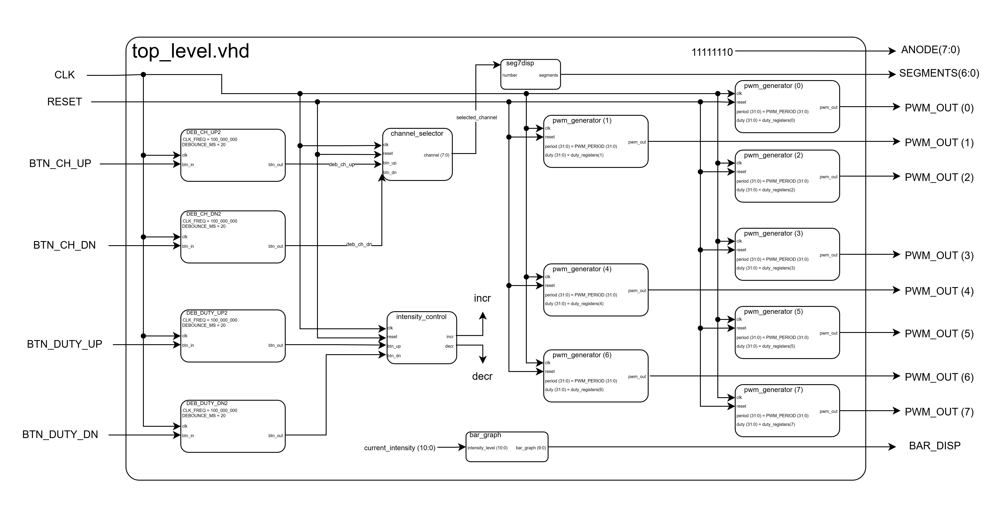
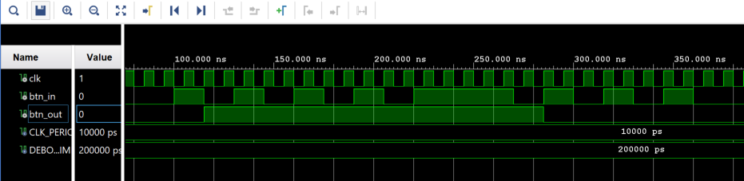
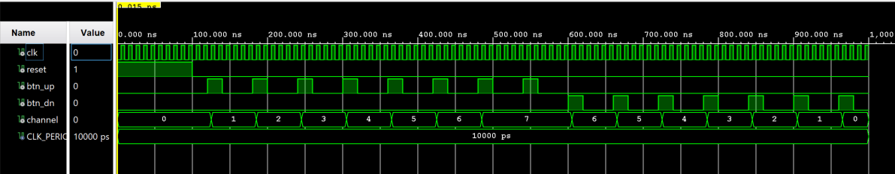
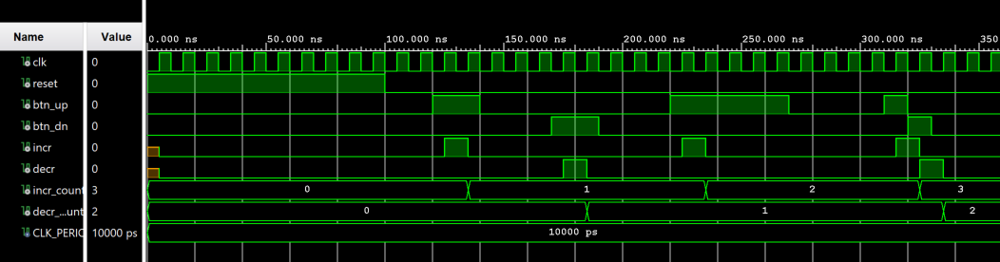
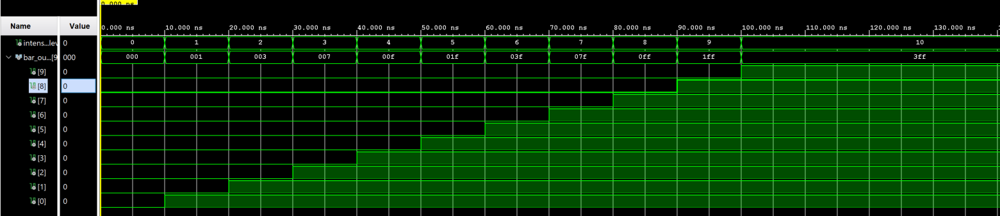
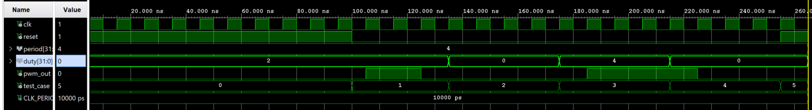

# Configurable multi-channel Pulse Width Modulation (PWM) for LED brightness control

### Team members

* Vojtěch Smejkal -  Designed the main top-level architecture and completed the overall project. Implemented the PWM generator and top-level integration.
* Polák Tomáš - Developed the debouncer, intensity control, and channel selector. Also created the project video.
* Matúš Repáš - Implemented the bar graph and 7-segment display, designed the top-level schematic, and edited the README file.

* Even though these were our main individual contributions, the entire project was completed as a team effort.

### Abstract

This project presents a configurable multi-channel Pulse Width Modulation (PWM) system designed for precise LED brightness control. The system allows users to adjust the brightness of multiple LEDs independently by varying duty cycles across several PWM channels. A flexible interface enables easy reconfiguration of parameters such as frequency, duty cycle, and channel count, making the design adaptable to various lighting applications. Emphasis is placed on achieving smooth brightness transitions and minimizing flicker through optimized PWM signal generation. Overall, this configurable PWM solution offers a scalable, customizable method for efficient LED brightness management in diverse environments.

The main contributions of the project are:

* Implementation of a PWM signal generator with adjustable duty cycle, controlled using FPGA pushbuttons.

* Design of a user interface using five onboard buttons (BTNR, BTNL, BTND, BTNU, BTNC) for PWM adjustment, channel selection, and reset functionality.

* Development of a bar graph display and 7-segment display to visually represent PWM signal parameters.

* Creation of a debouncing system to ensure reliable input from physical buttons.

* Integration of multiple modules into a top-level design, including signal routing and synchronization.

* Utilization of limited Pmod ports by distributing I/O between external LEDs and a BAR display, demonstrating efficient hardware resource management.

* Complete team collaboration, including system design, coding, simulation, schematic design, README preparation, and video/poster presentation.

## Hardware description of demo application
The FPGA board uses five buttons: BTNR, BTNL, BTND, BTNU, and BTNC. BTNR and BTNL control the duty cycle of the PWM signal, while BTND and BTNU are used to switch between different PWM outputs. BTNC serves as the central reset button, which restores the PWM settings to default, setting the duty cycle back to 50%.

For input/output, we utilize four pins from the JA Pmod port on the FPGA. Two pins are connected to external LEDs, and the remaining two are used for the BAR segment display. This configuration was necessary because the JB Pmod port, which is our primary interface, did not have enough available pins for the BAR segment display.

### Pmod Ports

### Schematic

## Software description

Put flowchats/state diagrams of your algorithm(s) and direct links to source/testbench files in `src` and `sim` folders.

### Component(s) simulations

### simulation of debouncer

### simulation of channel selector

### simulation of intensity controller

### simulation of bar graph

### simulation of pwm

## References

1. https://www.drawio.com/
2. https://github.com/tomas-fryza/vhdl-labs/tree/master
3. https://vhdl.lapinoo.net/
4. https://www.edaplayground.com/
